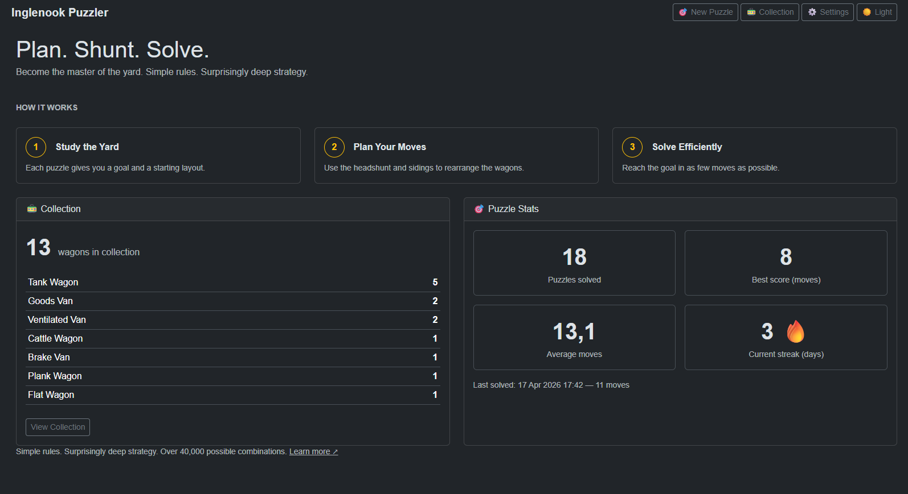
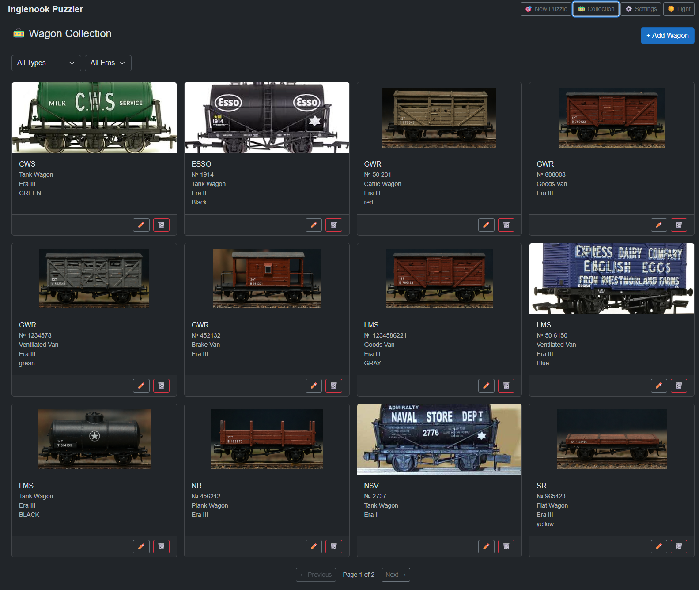
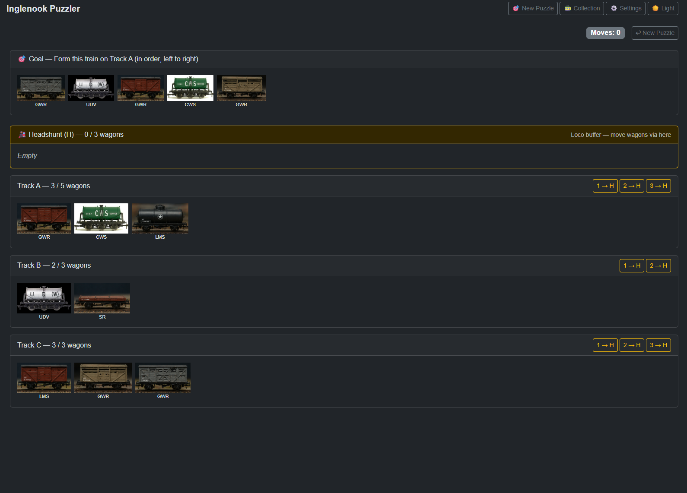

# 🚂 Inglenook Puzzler

A digital companion for the classic **Inglenook Sidings shunting puzzle** — built for model railway enthusiasts who want to practice with their own rolling stock.

> Built with Blazor Server · EF Core · SQLite · Self-contained

---

## What is the Inglenook Puzzle?

Inglenook Sidings is a model railway shunting puzzle created by **Alan Wright (1928–2005)**. The track layout is inspired by the real Kilham Sidings on the Alnwick-Cornhill branch of the North Eastern Railway. Wright's design turns a simple yard into a deceptively challenging logic puzzle.

- You have **8 wagons** distributed across three sidings (5-3-3)
- A headshunt allows you to move 1, 2 or 3 wagons at a time
- Your goal: form a **specific train of 5 wagons** on Track A — in the correct order
- A Brake Van, if included, must always be last

Simple rules. Surprisingly deep strategy. Over 40,000 possible combinations. [Learn more ↗](https://en.wikipedia.org/wiki/Inglenook_Sidings)

---

## Features

**Wagon Collection**
- Add your own wagons with photos, rolling stock numbers, type and era
- Upload photos from your phone or camera — automatically cropped and resized
- Default images per wagon type if no photo is available

**Puzzle**
- Generates puzzles from your own collection — you see your actual wagons on screen
- Headshunt with correct movement rules (1, 2 or 3 wagons per move)
- Move counter — one move per loco operation regardless of wagon count
- Brake Van always placed last in goal automatically
- Filter puzzles by era and wagon type
- Win detection and session saving

**Settings**
- Define your own wagon types and eras
- Seeded with British Era I–III types and wagon types out of the box

**Dashboard**
- Collection overview with breakdown by wagon type
- Puzzle stats — total solved, best score, average moves, current streak

---

## Screenshots





---

## Stack


---

## Getting Started

**Prerequisites**
- .NET 10 SDK

**Clone and run**
```bash
git clone https://github.com/mib71/InglenookPuzzler.git
cd InglenookPuzzler/InglenookPuzzler
dotnet run
```

The database is created and seeded automatically on first run — no manual migration needed. Data and images are stored in `%APPDATA%\InglenookPuzzler\`.

---

## How to Play

1. **Settings** — configure your own wagon types and eras (or use the defaults)
2. **Collection** — add your wagons with photos and rolling stock numbers
3. **New Puzzle** — generate a puzzle from your collection, filter by era or wagon type
4. **Play** — use the headshunt to move wagons between tracks, form the goal train on Track A in the correct order

---

## Roadmap

| Version | Features |
|---|---|
| **V1** ✅ | Wagon collection, image upload, digital puzzle, move counter, win detection, session saving |
| **V2** | Print card for physical play, and maby more |

---

## Further Reading

- [Inglenook Sidings — Wikipedia](https://en.wikipedia.org/wiki/Inglenook_Sidings)
- [Rules & Operation — wymann.info](https://www.wymann.info/ShuntingPuzzles/Inglenook/inglenook-rules.html)
- [Mathematical analysis of Inglenook puzzles — arxiv.org](https://arxiv.org/abs/1810.07970)

---

## About

Built by [mib71](https://github.com/mib71) — a .NET backend dev from Sweden who also happens to collect model railways.

🌐 [bifrostpixel.com](https://www.bifrostpixel.com)
